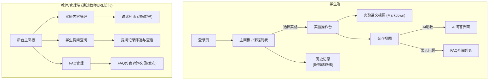
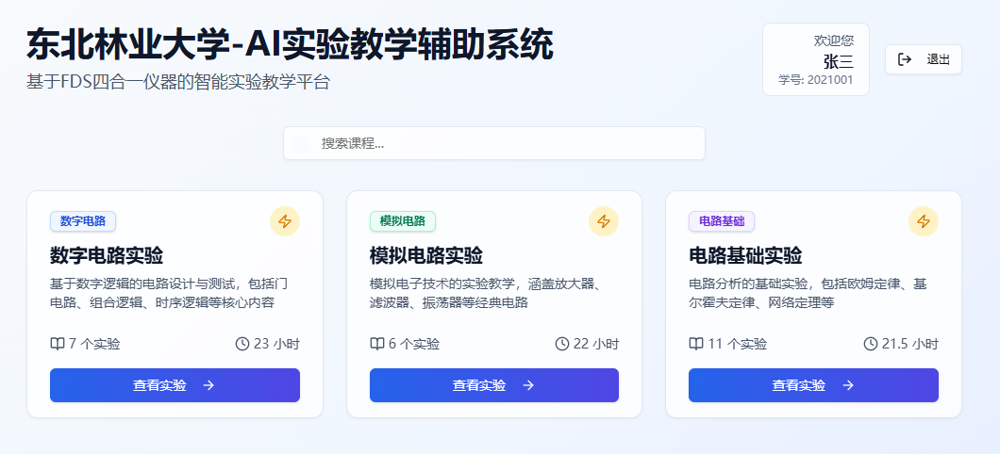
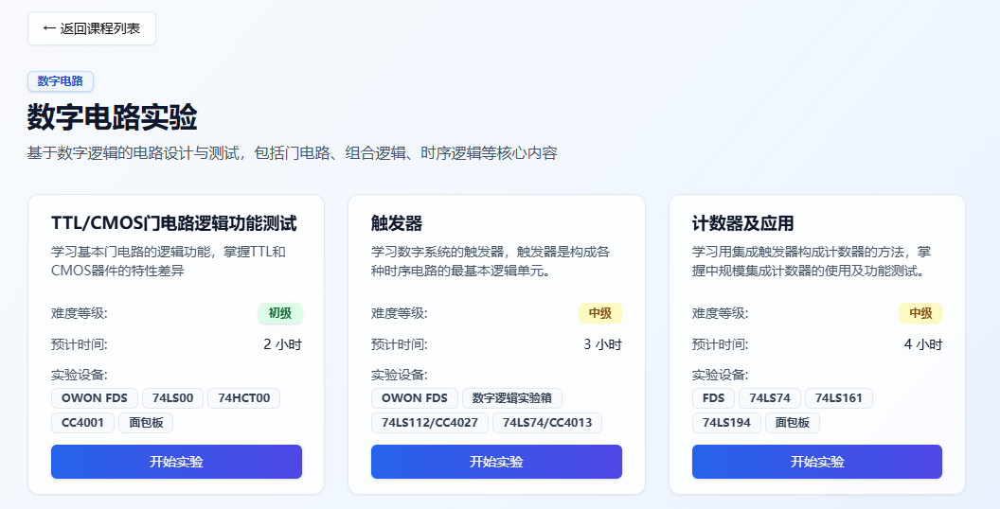
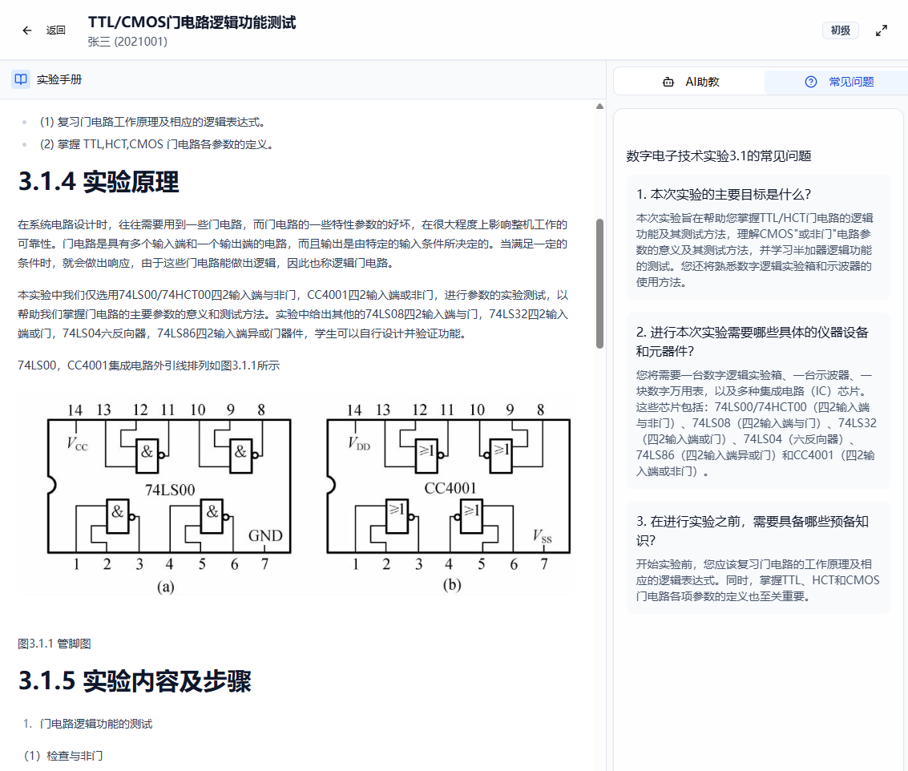
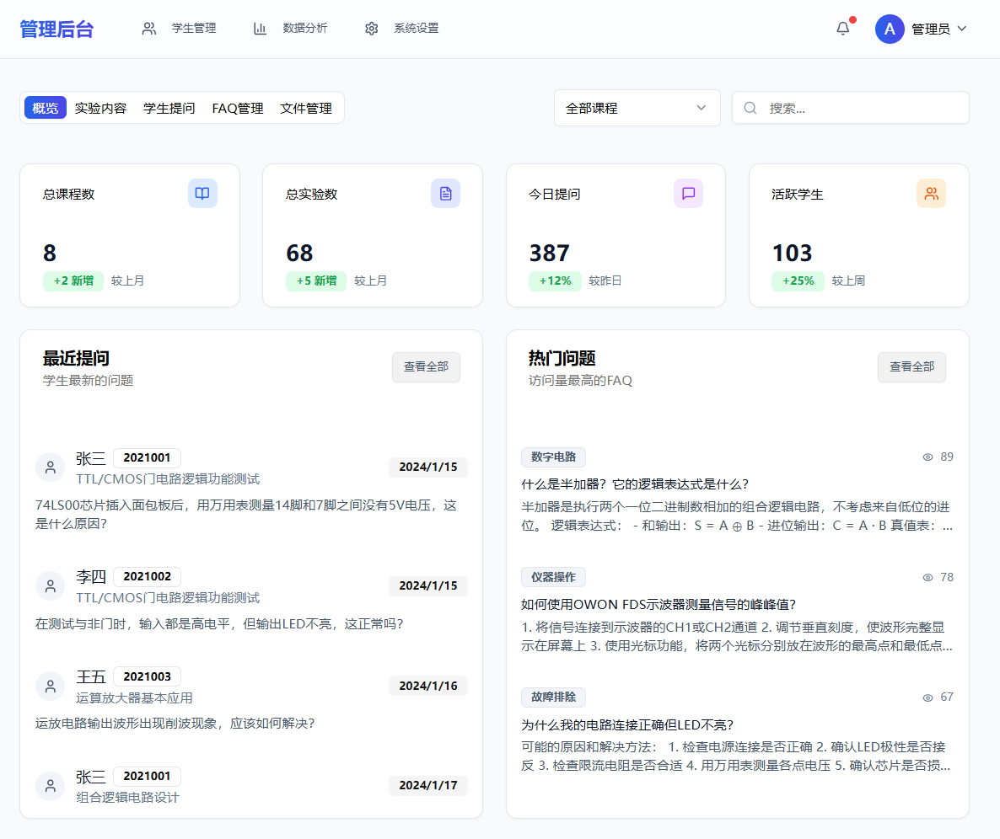

# 东北林业大学 AI实验教学系统项目介绍

## 1. 项目背景与意义

在当前高等教育中，电子电路实验教学是培养学生实践能力和创新思维的关键环节。然而，传统的实验教学模式面临诸多挑战。学生在实验过程中常因操作不熟练、理论与实践脱节、问题无法及时解决等原因，导致学习效率低下，甚至产生挫败感。与此同时，教师在实验指导中，需耗费大量精力解答重复性、基础性问题，难以将重心放在高阶思维培养和个性化指导上，这在一定程度上制约了教学质量的提升。

为响应国家“新工科”建设号召，推动信息技术与教育教学深度融合，本项目旨在引入人工智能（AI）技术和现代化实验设备，构建一个智能化的实验教学辅助系统。该系统旨在有效缓解上述痛点，提高教学效率，激发学生自主学习能力，为培养具备扎实理论基础和卓越实践能力的创新型人才提供有力支撑。

---

## 2. 项目目标

本项目致力于构建一个集智能问答、内容管理与数据分析于一体的实验教学辅助平台，核心目标如下：

* **提升学生学习体验与效果**：通过AI提供实时、精准的实验过程指导与问题解答，帮助学生及时解决实验中遇到的困惑，加深对实验原理、操作规程的理解，从而提升实验效率和学习成就感。
* **赋能教师教学效率与质量**：将教师从繁琐的基础性答疑工作中解放出来，使其能够将更多精力投入到课程设计优化、核心难点解析、启发式教学以及对学生整体学习情况的宏观把控与个性化辅导中，全面提升教学质量。
* **构建核心载体与应用场景**：系统将基于 **OWON FDS四合一仪器**（集示波器、信号发生器、万用表、电源于一体）进行设计与开发，并重点支持**数字电路**、**模拟电路**及**电路基础**等核心实验课程，确保项目成果的落地应用性。

---

## 3. 目标用户分析

为确保系统设计精准地满足教学需求，我们对核心用户进行了深入分析。

### 3.1. 学生 (Student)
* **画像**: 电子信息、自动化相关专业的本科生，理论基础尚可，但缺乏实验操作和问题排查的实践经验。
* **目标**:
    * 在实验中遇到问题时，能即时获得针对性的解答，独立完成实验。
    * 能方便地查阅常见问题（FAQ），快速找到解决方案。
* **核心诉求**: 需要一个智能、可靠、能在实验中随时提供帮助的“虚拟助教”。

### 3.2. 教师 (Teacher)
* **画像**: 负责实验课程的授课教师或实验员。
* **目标**:
    * 从重复性的基础答疑中解脱出来。
    * 通过查看学生的提问记录，了解学生的普遍困难。
    * 快速更新教学材料，并方便地将共性问题整理为FAQ。
* **核心诉求**: 需要一个能分担基础教学工作、易于维护、并能提供教学洞察的内容管理工具。

---

## 4. 系统功能与特色

本智能实验教学辅助系统主要包含**AI实验过程问答**和**实验内容管理后台**两大核心模块，并具备以下功能与特色：

### 4.1. AI实验过程问答模块

该模块是学生进行实验时获取即时帮助的主要界面，旨在提供高效、便捷的智能辅导体验。

* **集成化交互界面**：系统提供统一的界面，左侧展示当前实验的**Markdown格式官方讲义** , 右侧为AI问答聊天框。学生在阅读讲义的同时可随时提问，实现无缝切换。
* **上下文感知问答**：AI问答功能的核心优势在于其**强依赖于当前实验讲义内容**的上下文理解能力。这意味着AI的回答并非泛泛而谈，而是能够针对以下各类问题提供专业、精准、相关的解答：
    * **理论概念解释**：如“什么是最大不失真输出功率？”
    * **仪器操作指导**：如“如何用示波器测量信号的峰峰值？”
    * **电路调试分析**：如“我测的A点电压为0V，与理论值不符，可能是什么原因？”
    * **元器件识别与引脚定义**：如“U1芯片的1号引脚是哪个？”
* **对话历史与数据积累**：学生与AI的所有问答记录将持久化存储于服务端**SQLite数据库**中。学生可回顾个人历史对话，同时，所有学生的提问数据将被匿名化处理并记录，为后续教师分析教学难点提供数据支撑。
* **常见问题（FAQ）查阅**：系统提供便捷的FAQ入口，学生可快速查阅教师整理发布的常见问题解答，实现自助式学习与问题排查。

#### 典型应用场景：学生实验过程
为了更直观地展示该模块的功能，我们设想一个典型应用场景：学生小明在进行“负反馈放大电路”实验时，发现示波器波形失真。他可以首先登录系统，进入该实验的操作台。操作台界面左侧为实验讲义，右侧为交互区。他可以先查阅“常见问题”选项卡，若无答案，则切换到“AI助教”进行提问：“我测量的输出波形顶部被削平了，可能是什么原因？”AI将结合当前实验上下文，在数秒内给出可能的原因，如电源电压不足或输入信号幅度过大。小明可进一步追问：“如何精确设置100mVpp的输入信号？”AI会提供在OWON FDS仪器上的具体操作步骤。整个过程支持多轮对话，且所有对话记录将与学生账号绑定并保存在云端，便于日后复习回顾。

### 4.2. 实验内容管理后台模块

该模块为教师提供便捷的教学资源管理和学生学习情况洞察工具，旨在提升教学管理效率。

* **讲义高效管理**：支持教师便捷地上传、更新、替换或删除**Markdown格式的实验讲义文件** , 并与具体实验项目进行关联。
* **学生提问可视化查阅**：教师可在后台清晰查看所有学生的提问流水记录（包含提问学生、时间、问题内容），并提供基本的筛选和搜索功能，便于快速定位和分析共性问题。
* **FAQ动态管理**：教师可基于学生高频提问或教学经验，灵活创建、编辑、删除和发布常见问题解答（FAQ），有效减少重复性答疑工作量。

#### 典型应用场景：教师内容管理
该后台模块旨在赋能教师，提升教学管理效率。例如，王老师在学期中发现学生关于“负反馈放大电路”实验的提问较为集中。他可登录管理后台，通过“学生提问记录”功能，筛选并查看该实验的所有提问，快速洞察学生的共性难点。随后，他可以进入“FAQ管理”模块，将该共性问题及其标准答案新增为一条FAQ，并与该实验关联发布，供后续学生查阅。此外，如果他发现实验讲义存在笔误，还可以在“实验内容管理”中直接上传新版Markdown讲义文件，整个过程便捷高效。

---

## 5. 系统架构与设计

### 5.1. 信息架构
系统整体架构分为学生端和教师/管理端两部分，结构清晰，职责明确。

### 5.2. 学生页面展示

#### 5.2.1. 课程列表

#### 5.2.2. 选择实验

#### 5.2.3. 实验问答

#### 5.2.4. 常见问题

### 5.3. 教师管理后台展示

### 5.3. 关键界面设计理念
* **学生端**：
    * **登录页**：设计简洁，学生通过姓名、学号即可快速进入系统。
    * **实验操作台**：采用左右分栏布局，左侧为实验讲义，右侧为“AI助教”与“FAQ”整合的交互区。这种设计能确保学生在阅读和提问之间无缝切换，打造沉浸式学习体验。
* **教师端**：
    * **管理后台**：采用经典的侧边栏导航布局，功能模块包括实验内容管理、学生提问查阅、FAQ管理等，界面直观，操作便捷，便于教师高效管理教学资源。

---

## 6. 设计原则与非功能性需求

### 6.1. UX设计原则
为确保系统的高效稳定运行和良好的用户体验，本项目遵循以下核心UX设计原则：
* **目标导向**：所有设计都应服务于用户的核心目标——快速解惑和流畅操作。避免不必要的功能和干扰。
* **智能感与信赖感**：AI的交互应体现出智能（如上下文感知），其回答应专业准确，建立用户对系统的信赖。
* **无缝集成**：讲义阅读和AI问答应无缝集成在同一工作空间内，减少用户在不同任务间的切换成本。
* **即时反馈**：用户的每一个重要操作（如发送问题、发布FAQ、上传文件）都应获得即时的、清晰的系统状态反馈。
* **简洁与一致**：界面保持简洁，控件和布局在不同页面间保持一致性，降低用户的学习成本。

### 6.2. 非功能性需求与技术保障
* **性能**：AI问答响应时间要求95%的请求在3秒内返回；静态页面（如实验讲义）加载时间应小于1秒，确保流畅的用户体验。
* **可用性**：系统界面设计直观简洁，符合学生操作习惯，主流浏览器兼容性良好，并具备响应式设计，以适应实验室常见电脑分辨率。
* **可靠性**：在正常实验教学时段（周一至周五，8:00-18:00），系统可用性目标达到99.9%，保障教学活动顺利进行。
* **安全性**：学生登录信息（姓名、学号）妥善存储；管理后台通过特定URL进行访问控制，未来将升级为账户密码登录机制，确保数据安全。
* **数据存储**：对话历史和提问记录统一采用服务端**SQLite数据库**进行存储管理。

---

## 7. 未来发展规划

本项目将分阶段逐步完善，持续提升系统的智能化水平和教学辅助能力：

* **V1.1 - 智能数据分析与多模态交互**：
    * **智能数据分析**：利用AI技术对学生提问热点进行自动聚合分析，形成教学报告供教师参考，从而优化教学内容，完善FAQ。
    * **多模态交互**：探索支持学生上传电路照片，AI辅助识别连接错误，提供更直观的故障排除指导。
* **V2.0 - 深化仪器集成与报告自动化**：
    * **深化仪器集成**：在前期调研基础上，实现与OWON FDS仪器的双向数据通信与控制，为远程实验和智能评测奠定基础。
    * **实验报告自动生成**：AI辅助学生整理实验数据、生成图表，并撰写实验报告初稿，显著减轻学生负担，提升报告质量。

---

## 8. 总结

东北林业大学智能电子电路实验教学辅助系统是响应新时代教育教学改革的积极探索与实践。通过深度融合人工智能技术与专业实验设备，本项目旨在构建一个学生乐于使用、教师高效管理的智能平台。我们坚信，该系统的建成将显著提升我校电子电路实验教学的质量与效率，为培养高素质创新型工程人才贡献力量。