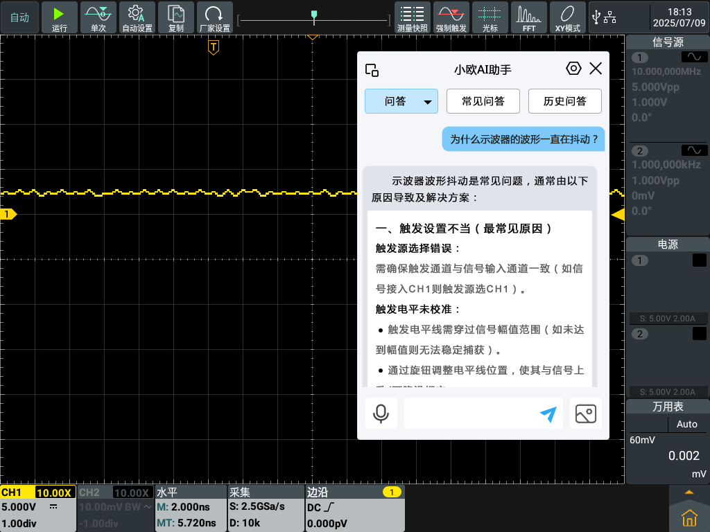
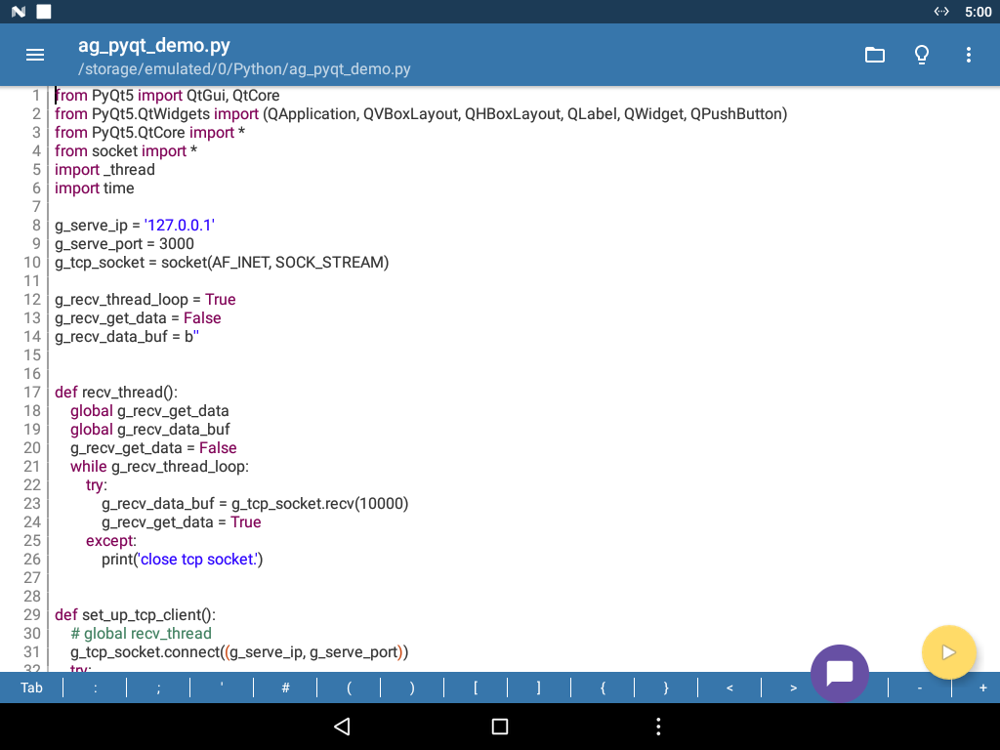
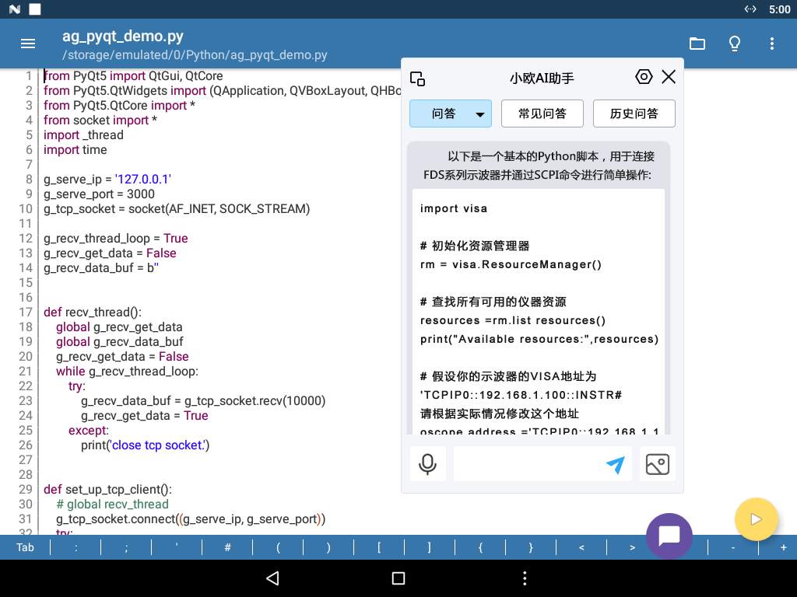

# 东北林业大学AI教学仪器

## **摘要**

本报告介绍了一款创新的AI赋能四合一示波器，它将传统示波器、万用表、可调电源和信号源功能整合，并深度融合大语言模型（LLM）技术。该设备通过智能问答、多角色模拟、智能控制代理（支持SCPI直控与Python代码自动生成执行）和实验代理等功能，旨在提升测试测量效率、降低操作门槛、优化用户学习体验，并为电子工程、科研及教学提供智能解决方案。

## **1\. 引言与项目背景**

面对传统测试测量设备操作复杂、学习曲线长、自动化程度低等挑战，本产品旨在通过智能化、人性化的交互方式，革新测试测量范式，并为工程教育提供先进的实践平台。

## **2\. 产品概述与核心功能**

本设备是一款高度集成的智能测试测量平台，其核心功能包括：

#### **2.1 FDS四合一集成功能**

* **示波器：** 高性能数字示波器，提供精确的波形捕获、分析与显示。  
* **万用表：** 集成高精度数字万用表功能，支持电压、电流、电阻等测量。  
* **可调电源：** 提供稳定可调的直流电源输出。  
* **信号源：** 内置多种波形生成器，可输出标准或自定义信号。
* **小欧AI助手** 内置AI助手，结合仪器和编程文档问答，AI自动编写和运行Python脚本。

### 2.2 Pydroid应用

设备内部深度集成了基于Pydroid应用的强大Python运行环境，支持LLM生成的Python代码无缝传输并立即执行。该应用包含以下特性：

* **直接开发与调试平台：** 为学生和研究人员提供一个直接在仪器上进行Python程序开发、调试和运行的平台。  
* **增强动手实践能力：** 学生能够亲自动手编写、修改和运行Python脚本，实现对仪器的精确控制。  
* **数据获取与控制：** 可利用SCPI命令获取示波器波形数据、万用表测量结果，或控制可调电源和信号源的输出参数。  
* **高级数据处理与分析：** 学生可基于原始数据进行高级数学运算、信号处理、数据可视化和算法验证，深入理解测试测量原理。  
* **本地化高效操作：** 无需将数据导出到外部计算机，即可在设备本地高效完成复杂的自动化任务和个性化实验。  
* **提升教学与科研效率：** 显著增强学生的动手实践能力、编程能力和解决实际工程问题的能力，提升教学效果和科研效率。

### **2.3 大语言模型（LLM）深度融合**

大型语言模型（**LLM**）作为本产品的核心智能引擎，赋予设备强大的理解、推理和交互能力，特别适用于高校电子电工实验教学与科研场景。

#### 2.3.1 智能问答系统 

我们的智能问答系统支持文字和语音多模态交互，能够即时解决学生在实验中遇到的各种问题。例如：

* **仪器操作**: “示波器怎么校准？” “万用表如何测量电流？”
* **测量原理**: “RLC串联谐振电路的特性是什么？” “PN结的正向偏置原理是什么？”
* **电路分析**: 针对学生搭建的电路，LLM可以辅助分析电路功能，甚至指出潜在的设计缺陷或计算错误。
* **故障诊断**: 当实验结果不符合预期时，LLM能根据现象提供初步的故障排查思路，例如：“示波器波形异常，可能的原因有哪些？”

通过这种方式，LLM成为了学生身边触手可及的“实验指导老师”，显著提高学习效率和实验独立性。

---

#### 2.3.2 沉浸式角色模拟 

LLM可化身为多种智能角色，为学生提供定制化的学习和指导体验，特别契合不同学生的学习习惯和需求：

* **默认**: 提供标准、全面的解答。
* **专业教授**: 深入浅出地讲解复杂理论知识，例如“能详细解释一下戴维宁定理在复杂电路分析中的应用吗？”
* **耐心导师**: 循循善诱地引导学生思考，例如在实验遇到瓶颈时，给出启发性问题而非直接答案。
* **活泼学姐**: 用更轻松、生动的语言分享实验经验和技巧，帮助新生快速适应实验环境。
* **实验助手**: 专注于提供实验操作细节、步骤提醒和安全注意事项，确保实验顺利进行。
* **严格导师**: 挑战学生的理解深度和批判性思维，通过提问促使学生主动查阅资料、验证假设。

---

#### 2.3.3 智能控制代理 

LLM的智能控制代理功能为高校师生带来了革命性的实验体验，特别是对于**学生进行二次开发和创新实验**提供了强大支持。

##### 智能决策逻辑 

LLM能够根据学生的自然语言指令智能判断并执行操作。

* **直接SCPI命令执行**: 学生可以说：“设置信号发生器输出频率为1kHz，幅度为5Vpp。” LLM能立即转换为对应的SCPI命令并执行。
* **复杂逻辑自动编写与执行**: 当指令涉及更复杂的逻辑时，例如“测量这个RC电路的频率响应曲线”，LLM可以自动编写并执行Python代码，控制仪器（如扫频仪、示波器）完成一系列测量，并自动绘制结果曲线。这极大地降低了学生编程控制仪器的门槛。

##### Python代码生成与执行 

这是LLM在高校场景中的一大亮点。

* **AI辅助开发**: 学生可以直接向LLM描述他们的实验构想或数据分析需求，LLM能够生成相应的Python代码片段，用于仪器控制、数据采集、数据处理和可视化。例如，学生可以提出：“帮我写一个Python脚本，控制示波器采集1000个点的数据并保存为CSV文件。” LLM将生成可直接运行的代码。
* **创新实验平台**: 这一功能让学生能够**突破传统实验手册的限制**，**自主设计和实现更具创新性的实验**。他们可以利用LLM快速构建定制化的测量方案，探索不同的电路参数组合，甚至开发自己的自动化测试程序。LLM成为了学生进行**科学研究和工程实践的强大AI辅助开发工具**。

##### 智能规划与可修改性 

对于涉及LLM多步骤规划的任务（例如，一个复杂的自动化测试流程或一个需要迭代优化的设计任务），系统会生成详细的执行规划供用户审阅和修改。

* **用户可控性**: 学生可以检查LLM生成的步骤，理解其逻辑，并根据自己的需求进行调整和优化。这不仅保证了实验的准确性，也提供了一个极佳的学习机会，让学生深入理解自动化流程的设计。
* **促进深度学习**: 通过审阅和修改LLM的规划，学生能够锻炼自己的系统设计能力、问题解决能力和批判性思维，而不是简单地执行预设步骤。这鼓励学生将精力集中在**实验设计和结果分析**上，而非繁琐的编程细节。

#### **2.4 语音输入功能**

支持语音指令交互，释放双手，提升操作便捷性和工作效率。

## **3\. 项目意义与创新性**

* **技术创新：** 首次将大语言模型与多功能测试测量设备深度结合。  
* **功能集成：** 四合一设计提升功能密度和使用便捷性。  
* **智能化水平：** 智能问答、角色模拟、智能控制代理等功能将智能化水平提升到全新高度。  
* **教育赋能：** 提供智能实践平台，培养高素质人才。  
* **行业影响：** 有望引领测试测量行业向更智能、自动化、人性化方向发展。

## **4\. 展望与未来发展**

未来将持续优化LLM性能、扩展智能控制代理覆盖范围、增加预设实验类型，并探索与其他智能系统的集成，提供更全面领先的测试测量解决方案。