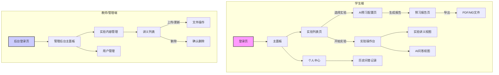

# UX 需求文档：AI实验教学辅助系统

**版本：1.0**

**日期：2024-07-30**

---

## 1. 简介

本文档从用户体验（UX）的角度出发，详细阐述“AI实验教学辅助系统”的设计需求。旨在为设计师和开发团队提供清晰的指导，确保最终产品能够为学生和教师提供直观、高效、流畅的使用体验。本文档基于产品需求文档 `dbly_req2.md` 编写。

## 2. 用户画像 (User Personas)

### 2.1. 学生 (Student)
- **画像**: 电子信息、自动化相关专业的本科生，理论基础尚可，但缺乏实验操作和问题排查的实践经验。
- **目标**:
    - 高效预习，抓住实验重点。
    - 在实验中遇到问题时，能即时获得针对性的解答，独立完成实验。
- **核心诉求**: 需要一个智能、可靠、随时可用的“虚拟助教”。

### 2.2. 教师 (Teacher)
- **画像**: 负责实验课程的授课教师或实验员。
- **目标**:
    - 从重复性的基础答疑中解脱出来。
    - 快速更新和管理教学材料，确保AI辅导内容的时效性。
- **核心诉求**: 需要一个能分担基础教学工作、易于维护的内容管理工具。

---

## 3. 用户旅程 (User Journeys)

### 3.1. 学生旅程一：实验前 - “AI带我预习”
**场景**: 学生小明下周有一节“负反馈放大电路”的实验课。他希望提前做好准备。

| 步骤 | 用户行为 | 系统交互与界面反馈 | 体验要点 |
| :--- | :--- | :--- | :--- |
| 1. 登录系统 | 小明打开系统网址，使用学号登录。 | 显示简洁的登录界面。登录后进入学生主面板。 | 登录过程顺畅。 |
| 2. 选择实验 | 在主面板上，小明看到一个清晰的实验列表，他找到了“负反馈放大电路”并点击。 | 主面板以卡片或列表形式展示所有可用实验，包含实验名称和简短描述。点击后进入预习配置页面。 | 实验列表清晰易懂，方便查找。 |
| 3. 定制AI导师 | 系统提供选项让小明定制AI导师的风格。他选择了“深入”的深度等级和“循循善诱”的沟通风格。 | 界面提供清晰的下拉菜单或选项按钮（如 `入门/标准/深入`，`严谨/生动/循循善诱`）。选择后即时生效。 | 定制选项直观，用词易于理解。 |
| 4. 生成预习报告 | 小明点击“生成预习报告”按钮。 | 系统显示一个加载动画（如“AI导师正在为您准备报告...”），几秒后呈现一份结构化的预习报告。 | 生成过程有即时反馈，等待时间短。 |
| 5. 查看与学习 | 报告内容包含实验目的、原理、步骤、思考题等。小明可以滚动查看所有内容。 | 报告排版清晰，重点突出（如使用粗体、列表、引用块）。 | 阅读体验良好，信息层次分明。 |
| 6. 导出报告 | 小明想把报告存到本地，他点击了“导出”按钮，并选择了PDF格式。 | 弹出导出选项（PDF, Markdown），点击后触发浏览器下载。 | 导出功能稳定，格式兼容性好。 |

### 3.2. 学生旅程二：实验中 - “AI伴我操作”
**场景**: 实验过程中，小明发现示波器上显示的波形出现了失真，与理论不符。

| 步骤 | 用户行为 | 系统交互与界面反馈 | 体验要点 |
| :--- | :--- | :--- | :--- |
| 1. 进入实验 | 小明在实验室电脑上登录系统，选择“负反馈放大电路”，点击“开始实验”。 | 系统加载一个分栏视图：左侧是官方实验讲义，右侧是AI问答聊天窗口。讲义定位到当前实验。 | 界面布局合理，讲义和问答区共存且互不干扰。 |
| 2. 遇到问题 | 小明在讲义中对照自己的操作，发现问题后，将光标移到右侧聊天框。 | 聊天框有清晰的输入提示，如“你好，有什么可以帮你的吗？”。 | 交互引导清晰。 |
| 3. 向AI提问 | 小明输入问题：“我测量的输出波形顶部被削平了，可能是什么原因？” | 输入时聊天框可随内容自适应高度。发送后，问题以气泡形式出现在聊天记录中。 | 输入体验流畅。 |
| 4. 获得解答 | AI在几秒内回复，并结合当前实验的上下文给出几种可能的原因（如“电源电压不足”或“输入信号幅度过大”）。 | AI的回答同样以气泡形式呈现，排版清晰，关键术语可高亮。回答应直接、切题。 | 回答快速、专业、且与当前实验高度相关。 |
| 5. 追问与解决 | 小明根据提示检查了信号发生器的设置，发现是输入信号幅度过大。他继续向AI提问：“如何精确设置100mVpp的输入信号？” AI给出了在OWON FDS上的具体操作步骤。 | AI能够理解追问，并保持对话的上下文连贯性。 | 支持多轮对话，能解决连续问题。 |
| 6. 回顾记录 | 实验结束后，小明可以在个人中心找到这次实验的完整问答记录。 | 对话历史按实验分类保存，便于回顾和复盘。 | 历史记录易于查找和回顾。 |

### 3.3. 教师旅程：内容管理 - “我来更新讲义”
**场景**: 教师王老师发现“验证欧姆定律”的实验讲义中有个笔误，需要更新为最新版本。

| 步骤 | 用户行为 | 系统交互与界面反馈 | 体验要点 |
| :--- | :--- | :--- | :--- |
| 1. 登录后台 | 王老师访问后台管理地址，使用教师账号和密码登录。 | 提供独立的、安全的后台登录页面。 | 权限区隔明确，安全性高。 |
| 2. 进入讲义管理 | 登录后进入管理后台主页，王老师点击侧边栏的“实验内容管理”。 | 后台界面布局清晰，导航明确（如Dashboard, 内容管理, 用户管理等）。 | 后台功能组织有序，易于导航。 |
| 3. 找到目标讲义 | 在讲义列表中，王老师通过实验名称快速找到了“验证欧姆定律”的条目。 | 列表形式展示所有实验及其关联的讲义文件，提供搜索和筛选功能。 | 快速定位目标内容。 |
| 4. 更新文件 | 王老师点击该条目旁的“更新”按钮，然后选择本地电脑上修改好的新版PDF讲义文件并上传。 | 弹出文件选择窗口。上传过程显示进度条。上传成功后，系统提示“文件更新成功”。 | 上传交互清晰，有明确的状态反馈。 |
| 5. 确认更新 | 列表中的讲义信息（如更新时间、版本号）立刻刷新。 | 界面数据实时更新，操作结果立即可见。 | 操作具有即时性，所见即所得。 |

---

## 4. 信息架构 (Information Architecture)

## 5. 关键页面线框图描述 (Key Screen Wireframes)

### 5.1. 学生主面板 / 实验列表 (Student Dashboard / Experiment List)
- **布局**: 采用卡片式布局，每个卡片代表一个实验。
- **卡片内容**: 实验名称、课程分类（如“模电”、“数电”）、一张代表性的图片或图标。
- **交互**:
    - 鼠标悬停在卡片上时，卡片轻微上浮或出现阴影，并显示“开始预习”和“进入实验”两个按钮。
    - 页面顶部提供搜索框，可以按实验名称快速筛选。

### 5.2. AI 预习报告页 (AI Preview Report)
- **布局**: 单栏长页面，适合阅读。
- **顶部**: 报告标题（如“XXX实验的AI预习指南”），AI导师风格（如“深度: 深入 | 风格: 循循善诱”），以及“导出”按钮。
- **内容区**:
    - 使用清晰的标题层级（H2, H3）来组织 `实验目的`、`核心原理`、`仪器清单` 等各个模块。
    - `仪器清单` 和 `元器件列表` 使用列表格式。
    - `详细步骤` 使用有序列表，关键操作或参数可加粗。
    - `思考题` 和 `常见问题` 使用引用块或特殊样式的卡片来突出显示。
- **侧边栏 (可选)**: 提供快速导航，点击可跳转到报告的不同章节。

### 5.3. 实验操作台 (In-Experiment Workspace)
- **布局**:
    - **桌面端**: 经典的左右分栏布局。左侧（约占2/3宽度）为PDF或Markdown渲染的实验讲义，右侧（约占1/3宽度）为AI聊天窗口。
    - **讲义视图**: 提供缩放、全屏、页码跳转等标准文档阅读功能。
    - **聊天视图**:
        - 顶部显示“AI助教”和在线状态。
        - 中间是对话历史记录区，用户和AI的消息用不同颜色或对齐方式的气泡区分。
        - 底部是文本输入框，支持多行输入，并有一个醒目的“发送”按钮。
- **响应式**: 在较小屏幕上，可考虑将聊天窗口变为可折叠的侧边栏或悬浮按钮激活的模态框。

### 5.4. 教师后台 - 讲义管理 (Admin - Content Management)
- **布局**: 经典的后台管理布局，左侧为导航菜单，右侧为内容区。
- **内容区**:
    - **顶部**: “上传新讲义”按钮。
    - **主体**: 一个表格（Table），每行代表一个实验讲义。
    - **表格列**: `实验名称`, `关联课程`, `文件名`, `文件格式`, `上传者`, `更新日期`, `操作`。
    - **操作列**: 包含“编辑关联”、“更新文件”、“删除”等按钮。
    - **上传/更新**: 点击后弹出模态框（Modal），引导用户选择文件并确认上传。

---

## 6. UX 设计原则 (UX Principles)

- **目标导向**: 所有设计都应服务于用户的核心目标——高效预习和快速解惑。避免不必要的功能和干扰。
- **智能感与信赖感**: AI的交互应体现出智能（如上下文感知），其回答应专业准确，建立用户对系统的信赖。UI上通过加载提示、清晰的回答格式等建立专业感。
- **无缝集成**: 讲义阅读和AI问答应无缝集成在同一工作空间内，减少用户在不同任务间的切换成本。
- **即时反馈**: 用户的每一个重要操作（如生成报告、发送问题、上传文件）都应获得即时的、清晰的系统状态反馈。
- **简洁与一致**: 界面保持简洁，控件和布局在不同页面间保持一致性，降低用户的学习成本。 