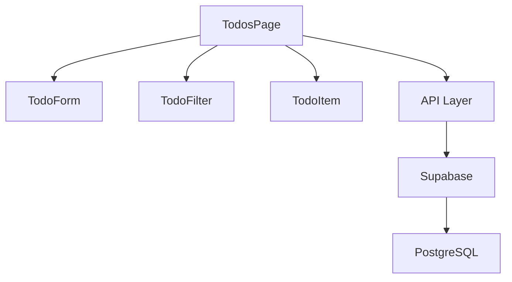
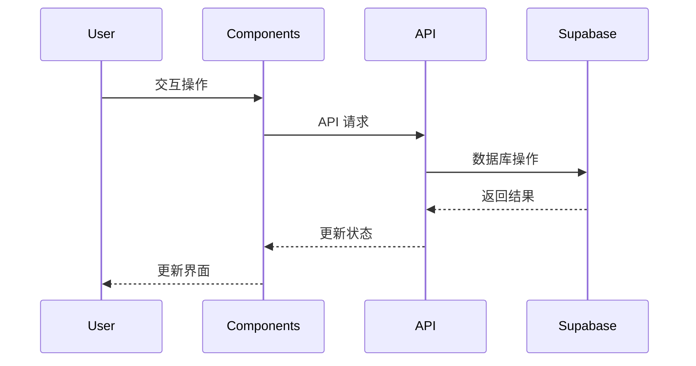

# TODO 功能实现文档

## 1. 功能概述

TODO 功能是一个基于 Next.js 和 Supabase 实现的任务管理系统，具有以下主要功能：

- 创建新任务
- 编辑任务
- 删除任务
- 标记任务完成/未完成
- 任务过滤（全部/进行中/已完成）
- 实时任务计数
- 用户认证和授权

## 2. 技术栈

- **前端框架**: Next.js 14 (App Router)
- **UI 组件**: shadcn/ui
- **样式**: Tailwind CSS
- **后端**: Supabase (PostgreSQL + Auth)
- **状态管理**: React Hooks (useState, useEffect)
- **API**: Next.js Route Handlers

## 3. 目录结构

```
src/
├── app/
│   ├── api/
│   │   └── todos/
│   │       └── route.ts           # TODO API 实现
│   └── protected/
│       └── todos/
│           └── page.tsx           # TODO 页面组件
├── components/
│   └── todo/
│       ├── TodoForm.tsx          # 新建任务表单
│       ├── TodoItem.tsx          # 单个任务项
│       └── TodoFilter.tsx        # 任务过滤器
└── lib/
    └── types.ts                  # 类型定义
```

## 4. 组件架构



## 5. 数据流



## 6. 组件详解

### 6.1 TodosPage (页面组件)

主要职责：
- 状态管理
- API 调用
- 错误处理
- 加载状态
- 组件协调

关键状态：
```typescript
const [todos, setTodos] = useState<Todo[]>([]);
const [filter, setFilter] = useState<FilterType>('all');
const [loading, setLoading] = useState(true);
const [error, setError] = useState<string | null>(null);
```

### 6.2 TodoForm (表单组件)

功能：
- 新建任务
- 表单验证
- 提交处理

接口：
```typescript
interface TodoFormProps {
  onAdd: (title: string) => void;
}
```

### 6.3 TodoItem (任务项组件)

功能：
- 显示任务
- 编辑任务
- 删除任务
- 切换完成状态

接口：
```typescript
interface TodoItemProps {
  todo: Todo;
  onToggle: (id: string) => void;
  onDelete: (id: string) => void;
  onEdit: (id: string, newTitle: string) => void;
}
```

### 6.4 TodoFilter (过滤器组件)

功能：
- 任务过滤
- 显示任务计数

接口：
```typescript
interface TodoFilterProps {
  currentFilter: FilterType;
  onFilterChange: (filter: FilterType) => void;
  counts: {
    all: number;
    active: number;
    completed: number;
  };
}
```

## 7. API 接口

### 7.1 获取任务列表

```typescript
GET /api/todos
Response: { todos: Todo[] }
```

### 7.2 创建任务

```typescript
POST /api/todos
Body: { title: string }
Response: { todo: Todo }
```

### 7.3 更新任务

```typescript
PUT /api/todos
Body: { id: string, title?: string, completed?: boolean }
Response: { todo: Todo }
```

### 7.4 删除任务

```typescript
DELETE /api/todos?id={todoId}
Response: { success: boolean }
```

## 8. 数据模型

```sql
CREATE TABLE todos (
  id UUID PRIMARY KEY DEFAULT uuid_generate_v4(),
  user_id UUID REFERENCES auth.users(id),
  title TEXT NOT NULL,
  completed BOOLEAN DEFAULT FALSE,
  created_at TIMESTAMP WITH TIME ZONE DEFAULT TIMEZONE('utc'::text, NOW()),
  updated_at TIMESTAMP WITH TIME ZONE DEFAULT TIMEZONE('utc'::text, NOW())
);
```

## 9. 安全性

- 所有 API 端点都需要用户认证
- 用户只能访问自己的任务
- 使用 Supabase RLS (Row Level Security) 策略
- API 层额外的用户验证

## 10. 性能优化

- 乐观更新 UI
- 错误处理和回滚
- 适当的加载状态
- 组件级别的状态管理
- 高效的过滤实现

## 11. 用户体验

- 响应式设计
- 加载状态反馈
- 错误提示
- 任务计数
- 悬停效果
- 动画过渡

## 12. 测试策略

- 组件单元测试
- API 集成测试
- E2E 测试 (Playwright)
- 数据库测试 